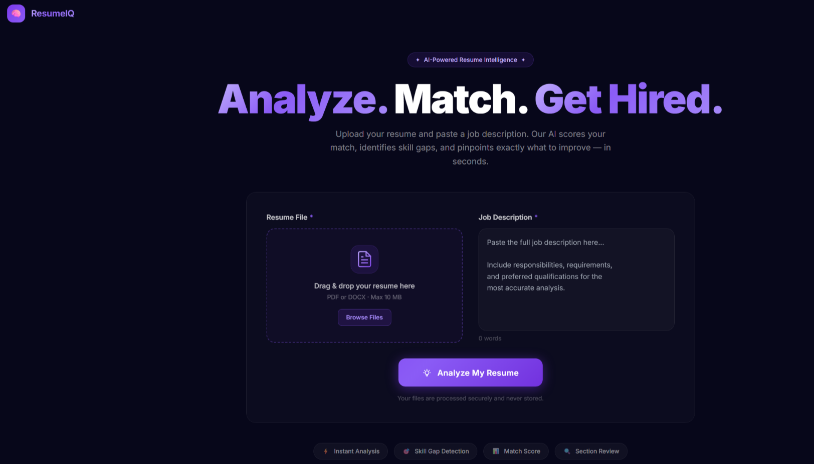
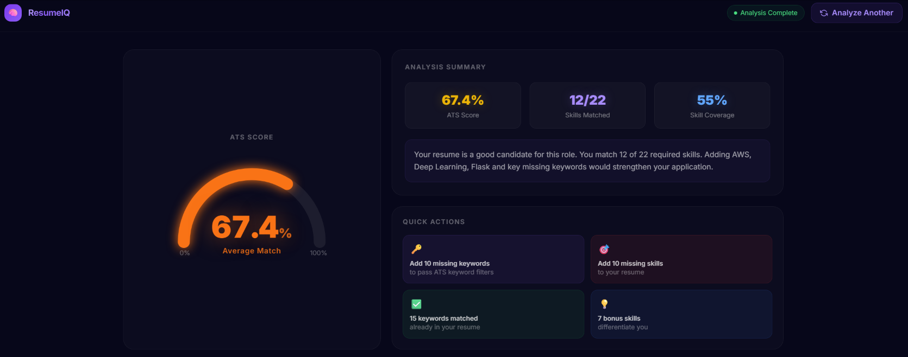
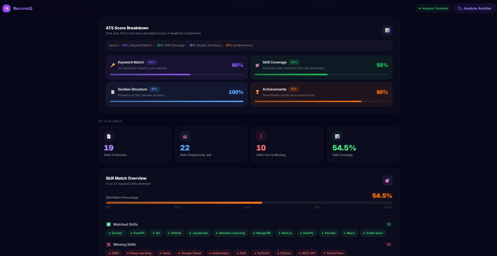

# ResumeIQ — AI Powered Resume & Job Match Analyzer

Upload your resume. Paste a job description.  
Get an instant ATS score, skill gap analysis, and actionable feedback — powered by NLP and semantic embeddings.

---

## 🚀 What is ResumeIQ?

ResumeIQ is a full-stack AI application that analyzes how well a resume matches a job description.

Unlike basic keyword scanners, ResumeIQ:

- Uses **Sentence Transformer embeddings** for semantic understanding
- Implements a **4-component weighted ATS scoring engine**
- Performs **skill gap analysis** using a structured 81-skill taxonomy
- Provides **fully explainable scoring**

Built to demonstrate production-level ML engineering — from data pipeline to deployed product.

---

## 📸 Screenshots

### Landing Page

### Results Dashboard

### Skill Gap Analysis

---

## 🧠 Core Features

- ✅ Weighted ATS Score (Keyword, Skill, Structure, Achievement)
- 📊 Score Breakdown with component transparency
- 🎯 Skill Gap Analysis (Matched / Missing / Extra skills)
- 📄 PDF & DOCX Resume Support
- ⚡ Animated Score Gauge
- 📱 Fully Responsive UI

---

## 🏗 Tech Stack

### Backend
- Python 3.11
- FastAPI
- Sentence Transformers (all-MiniLM-L6-v2)
- spaCy
- scikit-learn
- Docker

### Frontend
- React 18
- Vite
- Tailwind CSS
- shadcn/ui

### Deployment
- Frontend: Vercel
- Backend: Render (Docker)

---

## ⚙️ ATS Scoring Engine

The ATS score is calculated from 4 weighted components:

| Component | Weight | Purpose |
|------------|--------|----------|
| Keyword Match | 40% | JD technical keywords found in resume |
| Skill Coverage | 30% | Taxonomy skill overlap |
| Section Structure | 15% | Required resume sections present |
| Achievement Score | 15% | Quantified impact + strong verbs |

Score Labels:

| Score | Label |
|-------|--------|
| 95–100 | Perfect Match |
| 80–94 | Strong Match |
| 60–79 | Good Match |
| 40–59 | Partial Match |
| 0–39 | Low Match |

---

## 🧩 Why ATS-Based Scoring?

Pure semantic similarity produced unreliable results.

Real ATS systems prioritize:
- Keyword frequency
- Structured sections
- Explicit skills

ResumeIQ mirrors real-world ATS behavior while maintaining explainability.

pip install -r requirements.txt
python -m spacy download en_core_web_sm
uvicorn main:app --reload
